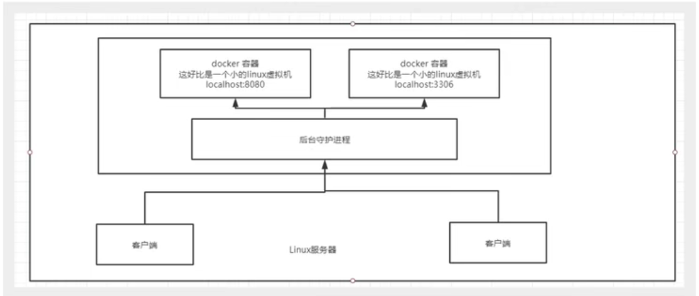
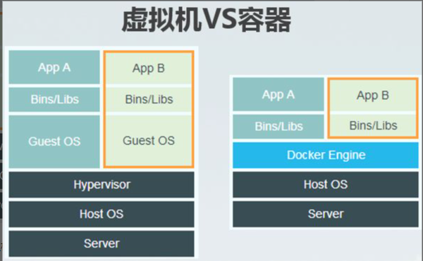

# Docker

[TOC]


## 安装Docker

```shell
环境准备Ubuntu
```

```shell
环境查看
# 系统内核
root@alms-virtual-machine:/var/lib/docker# uname -r
5.11.0-38-generic
```

```shell
#系统版本
root@alms-virtual-machine:/var/lib/docker# cat /etc/os-release
NAME="Ubuntu"
VERSION="20.04.3 LTS (Focal Fossa)"
ID=ubuntu
ID_LIKE=debian
PRETTY_NAME="Ubuntu 20.04.3 LTS"
VERSION_ID="20.04"
HOME_URL="https://www.ubuntu.com/"
SUPPORT_URL="https://help.ubuntu.com/"
BUG_REPORT_URL="https://bugs.launchpad.net/ubuntu/"
PRIVACY_POLICY_URL="https://www.ubuntu.com/legal/terms-and-policies/privacy-policy"
VERSION_CODENAME=focal
UBUNTU_CODENAME=focal
```

> 安装

```shell
#帮助文档

#1.卸载旧的版本
sudo apt-get remove docker docker-engine docker.io containerd runc

#2.添加Docker官方的GPG密钥
curl -fsSL https://download.docker.com/linux/ubuntu/gpg | sudo gpg --dearmor -o /usr/share/keyrings/docker-archive-keyring.gpg

#3 查看现在是否拥有了指纹
sudo apt-key fingerprint 0EBFCD88

#4 使用一下命令设置稳定存储库。
 echo \
  "deb [arch=$(dpkg --print-architecture) signed-by=/usr/share/keyrings/docker-archive-keyring.gpg] https://download.docker.com/linux/ubuntu \
  $(lsb_release -cs) stable" | sudo tee /etc/apt/sources.list.d/docker.list > /dev/null
 
#5 安装Docker引擎
#5.1 更新源
sudo apt-get update
#5.2 安装引擎
sudo apt-get install docker-ce docker-ce-cli containerd.io

#6测试
 sudo docker run hello-world


```

## Docker相关命令

>命令

```shell
#查看docker中运行的所有容器
docker ps -a

#关闭容器
docker stop “容器号”


```


## 底层原理

### Docker是怎么工作的？

Docker是一个Client-Server结构的系统，Docker的守护进程运行在主机上。通过Socket从客户端访问！

DockerServer接收到Docker-Client的指令



### Docker为什么比VM快？

1、Docker有着比虚拟机更少的抽象层

2、Docker利用的是宿主机的内核，vm需要是Guest



# Docker的常用命令

## 帮助命令

```shell
docker version     	#显示docker的版本信息
docker info 		# 显示docker的系统信息
docker --help		#万能命令
```

## 镜像命令

```shell
docker images		#查看所有本地的主机上的镜像

alms@alms-virtual-machine:~$ docker images
REPOSITORY    TAG       IMAGE ID       CREATED       SIZE
hello-world   latest    feb5d9fea6a5   4 weeks ago   13.3kB

#解释
REPOSITORY  镜像的仓库
TAG			镜像的标签
IMAGE ID  	镜像的id
CREATED		镜像的创建时间
SIZE		镜像的大小
```

```shell
docker search  #搜索镜像

alms@alms-virtual-machine:~$ docker search mysql
NAME                              DESCRIPTION                                     STARS     OFFICIAL   AUTOMATED
mysql                             MySQL is a widely used, open-source relation…   11587     [OK]       
mariadb                           MariaDB Server is a high performing open sou…   4407      [OK]       
mysql/mysql-server                Optimized MySQL Server Docker images. Create…   856                  [OK]
centos/mysql-57-centos7           MySQL 5.7 SQL database server                   91                   
mysql/mysql-cluster               Experimental MySQL Cluster Docker images. Cr…   88                   
centurylink/mysql                 Image containing mysql. Optimized to be link…   59                   [OK]
databack/mysql-backup             Back up mysql databases to... anywhere!         51                   
prom/mysqld-exporter                                                              43                   [OK]
deitch/mysql-backup               REPLACED! Please use http://hub.docker.com/r…   41                   [OK]
tutum/mysql                       Base docker image to run a MySQL database se…   35                   
linuxserver/mysql                 A Mysql container, brought to you by LinuxSe…   33                   
schickling/mysql-backup-s3        Backup MySQL to S3 (supports periodic backup…   31                   [OK]
mysql/mysql-router                MySQL Router provides transparent routing be…   23                   


```

```shell
docker pull 【软件名】 #拉取下载

#默认下载版本是最新版本

docker pull【软件名】:【版本号】 	#下载指定版本
```

```shell
#删除镜像
docker rmi

docker rmi -f 容器id

docker rmi -f 容器id 容器id 。。。。
docker rmi -f $(docker images -aq) #查出全部镜像id在递归删除镜像
```


## 容器命令

说明：有了镜像才可以创建容器，linux，下载一个centos镜像来测试学习

```shell 
1.docker pull centos #下载centos

2.#新建容器并启动
docker run 【可选参数】 image 

#参数说明
--name="NAME" 	容器名字 tomcat01 tomcat02 ，用来区分容器
-d			  	后台方式运行，
-it			使用交互方式运行，进入容器查看内容
-p    			指定容器的端口 -p 8080:8080
	-p ip：主机端口：容器端口
	-p 主机端口：容器端口（常用）
	-p 容器端口
	容器端口
-p				随机指定端口


#测试，启动并进入容器 
alms@alms-virtual-machine:~$ docker run -it centos /bin/bash
[root@fcd251b0b93e /]# [root@fcd251b0b93e /]# ls  # 查看容器内部
bin  dev  etc  home  lib  lib64  lost+found  media  mnt  opt  proc  root  run  sbin  srv  sys  tmp  usr  var
#从容器退出到主机
[root@fcd251b0b93e /]# exit
exit
```

**列出所有正在运行的容器**

```shell
#docker ps 命令
	#列出当前正在运行的容器
-a	#列出当前正在运行的容器+带出历史运行过的容器
-n=？	#显示最近创建的容器
-q	#只显示容器的编号


```

**退出容器**

```shell
exit	#直接容器停止并推出
Ctrl +P + Q	#容器不停止退出
```

**删除容器**

```shell
docker rm 容器id #删除指定容器，不能删除正在运行的容器，只能通过rm -f 删除
docker rm -f $(docker ps -aq) #递归删除所有容器
docker ps -a -q|xargs docker rm #删除所有的容器
```

**启动和停止容器的操作**

```shell
docker start 容器id	#启动容器
docker restart 容器id	#重启容器
docker stop 容器id	#停止容器
docker kill 容器id	#杀死容器
```


## 常用其他命令

**后台启动容器**

```shell
#命令docker run -d 镜像名
alms@alms-virtual-machine:~$ docker run -d centos

#问题docker ps，发现centos停止了

#常见的坑，dokcer容器使用后台运行，就必须要有一个前台进程，docker发现没有应用，就会自动停止
#nginx，容器启动后，发现自己没有提供服务，就会立刻停止，就是没有程序了
```

**查看日志**

```shell
docker  logs -f -t --tail 容器

#自己编写一段shell脚本
alms@alms-virtual-machine:~$  docker run -d centos /bin/sh -c "while true;do echo alms;sleep 1;done"

#alms@alms-virtual-machine:~$ docker ps 
CONTAINER ID   IMAGE     COMMAND                  CREATED         STATUS         PORTS     NAMES
13d4f902c370   centos    "/bin/sh -c 'while t…"   5 seconds ago   Up 4 seconds             vibrant_saha

#显示日志

-tf	#显示全部
--tail number #要显示的日志条数
alms@alms-virtual-machine:~$ docker  logs -tf --tail 10 13d4f902c370
```

